Ausgangspunkt war das Buch [Mazes for Programmers](https://pragprog.com/titles/jbmaze/mazes-for-programmers/) von Jamis Buck.

## Raster

Derzeit sind Raster mit kartesischen und Polarkoordinaten sowie welche auf der Basis von Dreiecken, Sechsecken und einer Mischung aus Vier- und Achtecken (Upsilon) implementiert.

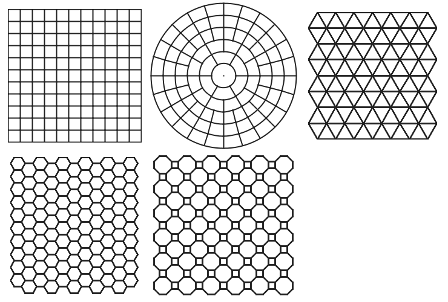

Die folgenden Algorithmen machen aus diesen Rastern Irrgärten durch Entfernen von Wänden zwischen den Zellen.

## Algorithmen

### Binary Tree

Der erste Algorithmus im Buch ist *BinaryTree*.
Eine Besonderheit ist, dass jede Zelle unabhängig von anderen entscheidet, welche Wand sie entfernt.
Da immer die Richtung Norden oder Osten entfernt werden, entstehen charakteristische durchgehende Wege am oberen und rechten Rand des Irrgartens:

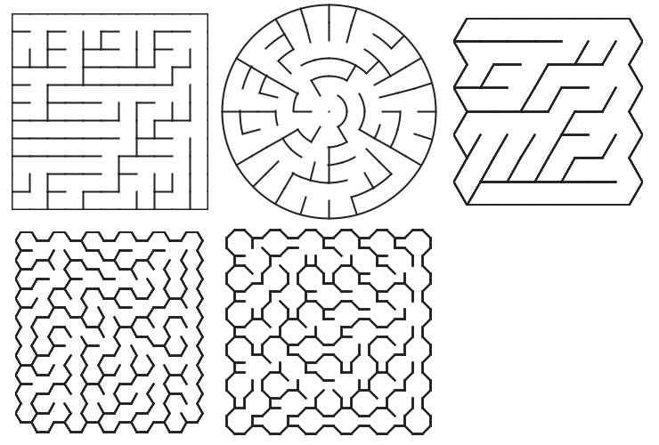

Auch die Textur der Irrgärten ist immer ähnlich:

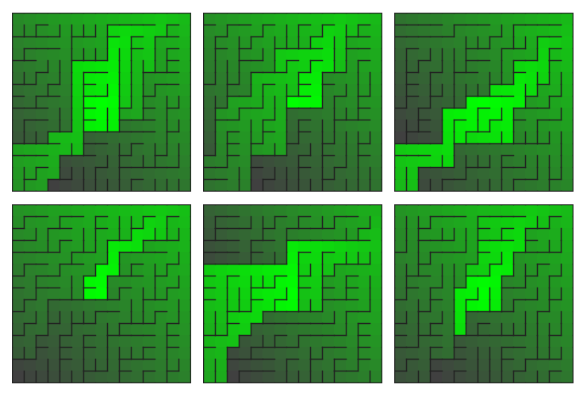

### Aldous Broder

Der Algorithmus *Aldous Broder* kann alle möglichen Irrgärten erzeugen:

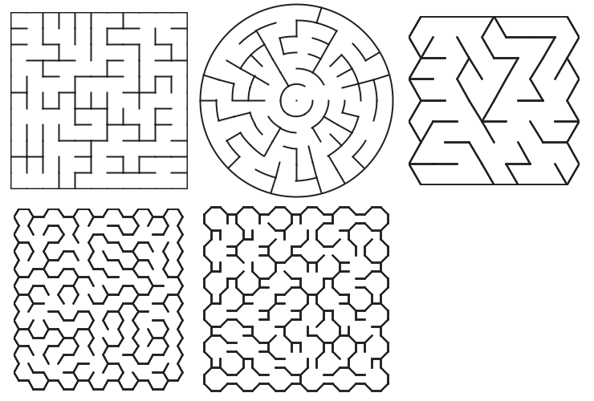

Dadurch gibt es kein wiedererkennbares Muster in den Irrgärten:

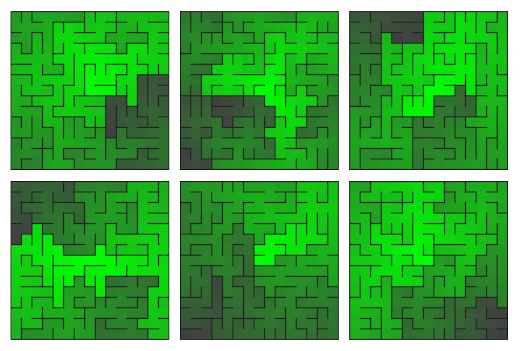

### Wilsons

Der Algorithmus *Wilsons* kann ebenfalls alle möglichen Irrgärten erzeugen:

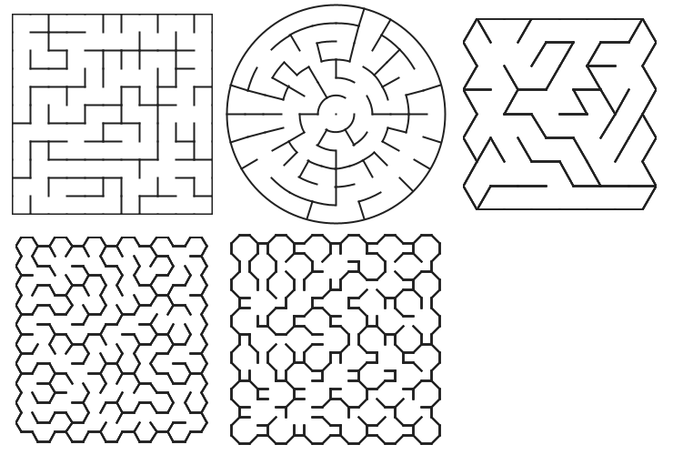

Sie sollten ähnlich wie die von *Aldous Broder* erzeugten Irrgärten aussehen:

Sowohl *Aldous Broder* als auch *Wilsons* können zwar alle Irrgärten erzeugen, sind aber relativ teuer und durch statistische Normalverteilung haben die Irrgärten immer ähnliche Texturen.
Die folgenden Algorithmen versuchen beide Probleme zu lösen.

### Hunt And Kill

Über *Hunt And Kill* habe ich grad nichts Besonderes zu erzählen:

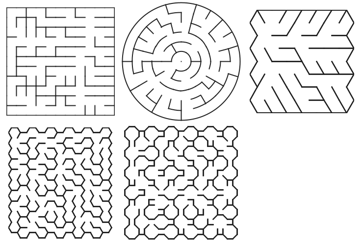

Die Textur zeichnet sich durch lange Wege und wenige Sackgassen aus:

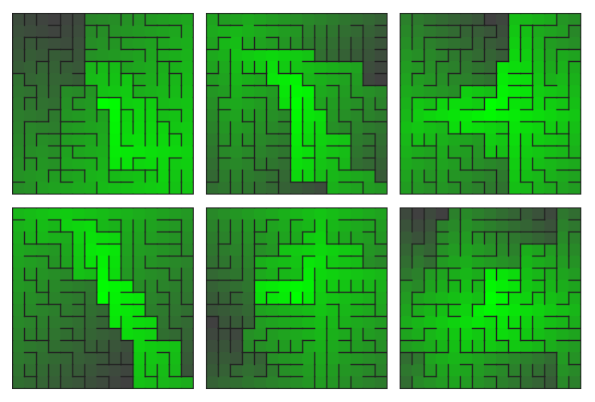

### Recursive Backtracker

Der Algorithmus *Recursive Backtracker* hat eine sehr schöne Implementierung.
Zudem ist er effizient, weil jede Zelle exakt zweimal betrachtet wird:

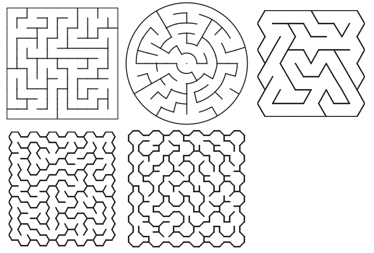

Dadurch ergibt sich eine Textur mit langen, mäandernden Wegen:

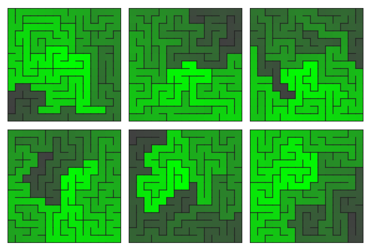

### Growing Tree

Der Algorithmus *Growing Tree* ist eine parameterisierte Implementierung anderer Algorithmen.
Als Parameter wird eine Funktion genutzt, die die nächste Zelle angibt, von der aus weiter gesucht wird.
Zunächst die Variante, wo die nächste Zelle *random* ausgewählt wird:

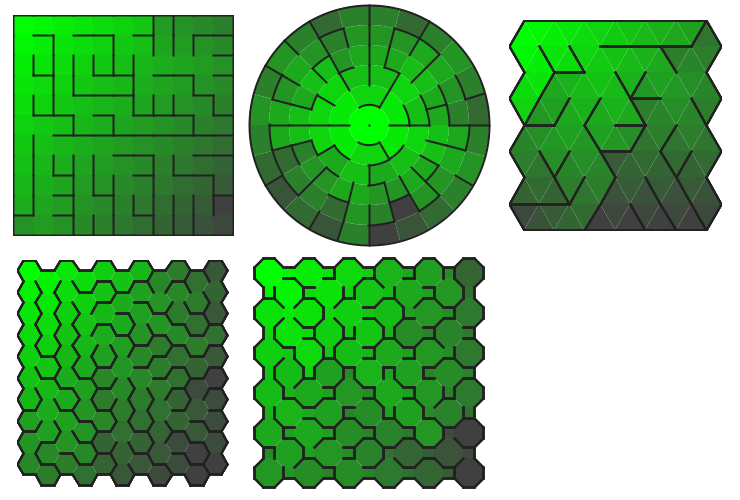

Mit der Variante *last* hat man den *Recursive Backtracker* nochmal implementiert:

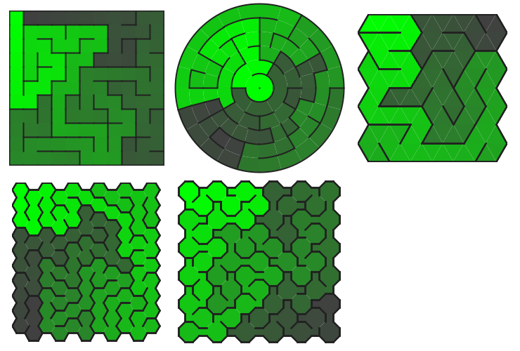

Durch Mischung der Funktionen kann man die Charakteristiken der einzelnen Algorithmen mischen, hier eine Mischung aus *last* und *random*: 

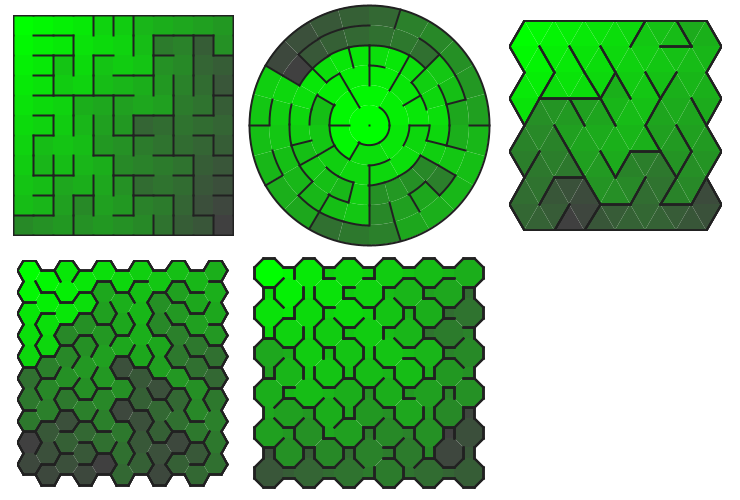
