## Improving Your Weaving

### Kruskal’s Algorithm

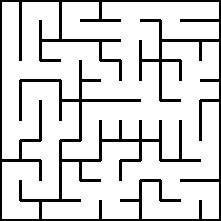
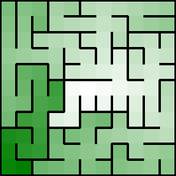

[Python](https://github.com/ocirne/mazes/tree/main/mazes-for-programmers/python/src/mazes/kruskals.py)

### Better Weaving With Kruskal

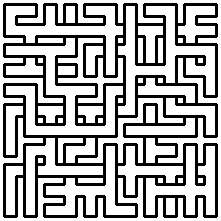
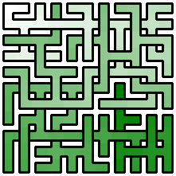

[Python](https://github.com/ocirne/mazes/tree/main/mazes-for-programmers/python/src/mazes/kruskals_weave_demo.py)

### Your Turn

## Growing With Prim’s

### Simplified Prim’s Algorithm

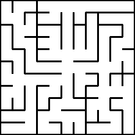
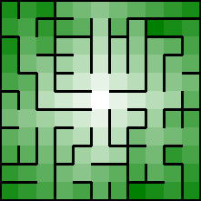

[Python](https://github.com/ocirne/mazes/tree/main/mazes-for-programmers/python/src/mazes/prims.py)

### True Prim’s Algorithm

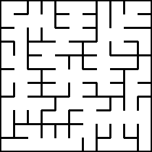
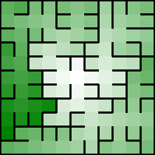

[Python](https://github.com/ocirne/mazes/tree/main/mazes-for-programmers/python/src/mazes/prims.py)

### The Growing Tree Algorithm

#### Select Random Cell

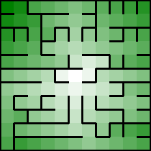

#### Select Last Cell

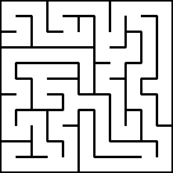
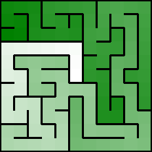

#### Select 50 % Random Cell / 50 % Last Cell

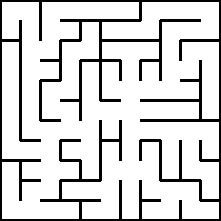
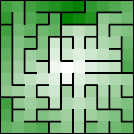

[Python](https://github.com/ocirne/mazes/tree/main/mazes-for-programmers/python/src/mazes/growing_tree.py)

### Your Turn

## Combining, Dividing
### Eller’s Algorithm

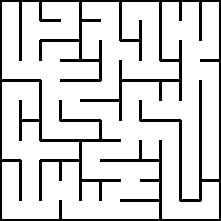
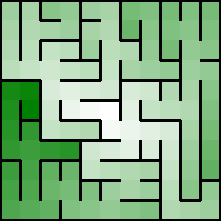

[Python](https://github.com/ocirne/mazes/tree/main/mazes-for-programmers/python/src/mazes/ellers.py)

### Recursive Division

#### No Rooms

#### With Rooms

[Python](https://github.com/ocirne/mazes/tree/main/mazes-for-programmers/python/src/mazes/recursive_division.py)
