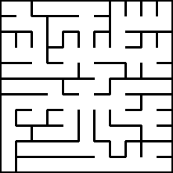
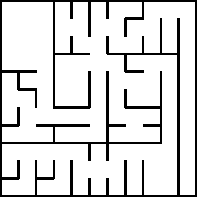

## Improving Your Weaving
### Kruskal’s Algorithm
### Implementing Randomized Kruskal’s Algorithm
### Better Weaving With Kruskal
### Implementing Better Weaving
### Your Turn

## Growing With Prim’s
### Introducing Prim’s Algorithm
### Simplified Prim’s Algorithm
### True Prim’s Algorithm
### The Growing Tree Algorithm

#### Select Random Cell

#### Select Last Cell

#### Select 50 % Random Cell / 50 % Last Cell

### Your Turn

## Combining, Dividing
### Eller’s Algorithm

[Python](https://github.com/ocirne/mazes/tree/main/mazes-for-programmers/python/src/mazes/ellers.py)

### Recursive Division

#### No Rooms

#### With Rooms

[Python](https://github.com/ocirne/mazes/tree/main/mazes-for-programmers/python/src/mazes/recursive_division.py)

### Bonus: Eller's on Polar Grid

TODO
