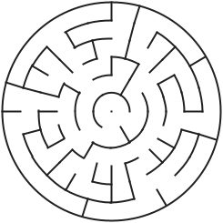
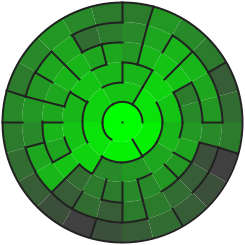
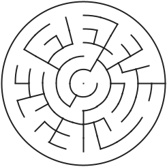
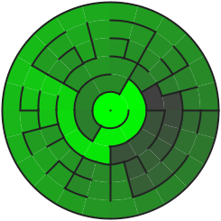
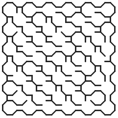
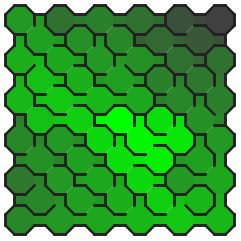

## Eller's on other Grids

### Bonus: Eller's on Polar Grid

#### From Edge to Center

#### From Center to Edge

[Kotlin](https://github.com/ocirne/mazes/tree/main/mazes-for-programmers/kotlin/src/main/kotlin/io/github/ocirne/mazes/demos/EllersGeneralizationDemo.kt)
| [Python](https://github.com/ocirne/mazes/tree/main/mazes-for-programmers/python/src/mazes/ellers_polar.py)

### Ellers's on Triangle Grid

TODO

### Ellers's on Hex Grid

TODO

### Ellers's on Upsilon Grid

[Kotlin](https://github.com/ocirne/mazes/tree/main/mazes-for-programmers/kotlin/src/main/kotlin/io/github/ocirne/mazes/demos/EllersGeneralizationDemo.kt)
