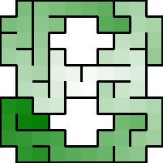
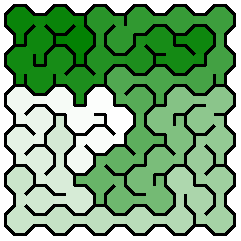
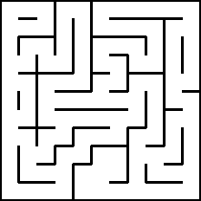

## Fitting Mazes to Shapes

### ASCII Masks


&nbsp;


[Python](https://github.com/ocirne/mazes/tree/main/mazes-for-programmers/python/src/mazes/ascii_mask.py)

### Image Masks


&nbsp;


[Python](https://github.com/ocirne/mazes/tree/main/mazes-for-programmers/python/src/mazes/image_mask.py)

### Bonus: Random Mask

```
+---+---+---+---+---+    ┏━━━━━━━┓       ┏━━━┓
|       |   |   |   |    ┃       ┃       ┃   ┃
+---+   +---+---+   +    ┗━━━┓   ┗━━━┯━━━┛   ┃
|   |       |       |        ┃       │       ┃
+---+---+   +   +   +        ┗━━━┓   ╵   ╷   ┃
|   |   |       |   |            ┃       │   ┃
+---+---+---+---+   +        ┏━━━┹───┲━━━┪   ┃
|   |       |   |   |        ┃       ┃   ┃   ┃
+---+   +   +---+   +    ┏━━━┛   ╷   ┗━━━┛   ┃
|       |           |    ┃       │           ┃
+---+---+---+---+---+    ┗━━━━━━━┷━━━━━━━━━━━┛
```

[Python](https://github.com/ocirne/mazes/tree/main/mazes-for-programmers/python/src/mazes/ascii_mask.py)

## Going in Circles

### Implementing a Polar Grid


&nbsp;


[Python](https://github.com/ocirne/mazes/tree/main/mazes-for-programmers/python/src/mazes/polar_grid.py)

### Your Turn


## Exploring Other Grids excerpt

### Hex Grid & Sigma Mazes


&nbsp;


[Python](https://github.com/ocirne/mazes/tree/main/mazes-for-programmers/python/src/mazes/hex_grid.py)

### Triangle Grid & Delta Mazes


&nbsp;


[Python](https://github.com/ocirne/mazes/tree/main/mazes-for-programmers/python/src/mazes/triangle.py)

### Bonus: Shaping Triangle Grid


&nbsp;


[Python](https://github.com/ocirne/mazes/tree/main/mazes-for-programmers/python/src/mazes/triangle.py)

### Bonus: Shaping Hex Grid


&nbsp;


[Python](https://github.com/ocirne/mazes/tree/main/mazes-for-programmers/python/src/mazes/hex_grid.py)

### Bonus: Upsilon Grid & Masked Upsilon Grid





[Python](https://github.com/ocirne/mazes/tree/main/mazes-for-programmers/python/src/mazes/upsilon_grid.py)

## Braiding and Weaving Your Mazes
### Braiding Mazes
#### Original


#### Braided




[Python](https://github.com/ocirne/mazes/tree/main/mazes-for-programmers/python/src/mazes/braid_demo.py)

### Implementing a Cost-Aware Dikstra’s Algorithm

#### Original


#### Rerouted


[Python](https://github.com/ocirne/mazes/tree/main/mazes-for-programmers/python/src/mazes/weighted_maze.py)

### Insets


&nbsp;


[Python](https://github.com/ocirne/mazes/tree/main/mazes-for-programmers/python/src/mazes/inset_demo.py)

### Generating Weave Mazes


&nbsp;


[Python](https://github.com/ocirne/mazes/tree/main/mazes-for-programmers/python/src/mazes/weave_grid.py)

### Bonus: Polar Grid with Insets


&nbsp;


[Python](https://github.com/ocirne/mazes/tree/main/mazes-for-programmers/python/src/mazes/polar_grid.py)
