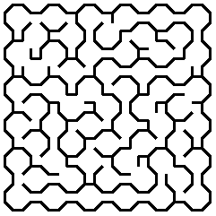

## Fitting Mazes to Shapes
### Introducing Masking
### Implementing a Mask
### ASCII Masks
### Image Masks
### Your Turn

## Going in Circles
### Understanding Polar Grids
### Drawing Polar Grids
### Adaptively Subdividing the Grid
### Implementing a Polar Grid
### Your Turn

## Exploring Other Grids excerpt

### Hex Grid & Sigma Mazes

 

[Python](https://github.com/ocirne/mazes/tree/main/mazes-for-programmers/python/src/mazes/hex_grid.py)

### Triangle Grid & Delta Mazes

 

[Python](https://github.com/ocirne/mazes/tree/main/mazes-for-programmers/python/src/mazes/triangle.py)

### Bonus: Shaping Triangle Grid

 

[Python](https://github.com/ocirne/mazes/tree/main/mazes-for-programmers/python/src/mazes/triangle.py)

### Bonus: Shaping Hex Grid

 

[Python](https://github.com/ocirne/mazes/tree/main/mazes-for-programmers/python/src/mazes/hex_grid.py)

### Bonus: Upsilon Grid & Masked Upsilon Grid

[Python](https://github.com/ocirne/mazes/tree/main/mazes-for-programmers/python/src/mazes/upsilon_grid.py)

## Braiding and Weaving Your Mazes
### Braiding Mazes
### Cost versus Distance
### Implementing a Cost-Aware Dikstra’s Algorithm
### Introducing Weaves and Insets
### Generating Weave Mazes
### Your Turn