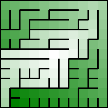
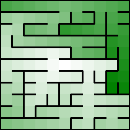
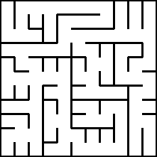
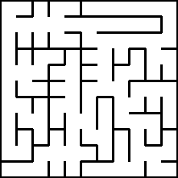
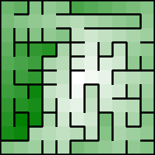

## Your First Random Mazes excerpt

Nothing to code so far.

## Automating and Displaying Your Mazes

### Introducing Our Basic Grid & Displaying a Maze on a Terminal

Printing the (cartesian) grid as ASCII art:

```
+---+---+---+---+
|   |   |   |   |
+---+---+---+---+
|   |   |   |   |
+---+---+---+---+
|   |   |   |   |
+---+---+---+---+
|   |   |   |   |
+---+---+---+---+
```

[Kotlin](https://github.com/ocirne/mazes/tree/main/mazes-for-programmers/kotlin/src/main/kotlin/io/github/ocirne/mazes/demos/CartesianGridAsciiDemo.kt)
| [Python](https://github.com/ocirne/mazes/tree/main/mazes-for-programmers/python/src/mazes/cartesian_grid_demo.py)

### Implementing the Binary Tree Algorithm

```
+---+---+---+---+
|               |
+   +   +---+   +
|   |   |       |
+   +---+   +   +
|   |       |   |
+---+---+   +   +
|           |   |
+---+---+---+---+
```

[Kotlin](https://github.com/ocirne/mazes/tree/main/mazes-for-programmers/kotlin/src/main/kotlin/io/github/ocirne/mazes/demos/BinaryTreeAsciiDemo.kt)
| [Python](https://github.com/ocirne/mazes/tree/main/mazes-for-programmers/python/src/mazes/binary_tree.py)

### Implementing the Sidewinder Algorithm

```
+---+---+---+---+
|               |
+   +   +   +   +
|   |   |   |   |
+   +---+---+   +
|           |   |
+   +   +---+---+
|   |           |
+---+---+---+---+
```

[Kotlin](https://github.com/ocirne/mazes/tree/main/mazes-for-programmers/kotlin/src/main/kotlin/io/github/ocirne/mazes/demos/SidewinderAsciiDemo.kt)
| [Python](https://github.com/ocirne/mazes/tree/main/mazes-for-programmers/python/src/mazes/sidewinder.py)

### Rendering a Maze as an Image


[Kotlin](https://github.com/ocirne/mazes/tree/main/mazes-for-programmers/kotlin/src/main/kotlin/io/github/ocirne/mazes/demos/BinaryTreeDemo.kt)
| [Python](https://github.com/ocirne/mazes/tree/main/mazes-for-programmers/python/src/mazes/binary_tree.py)

### Bonus: Unicode Grids

```
┏━━━━━━━━━━━━━━━┓
┃               ┃
┃   ╷   ╷   ╷   ┃
┃   │   │   │   ┃
┃   │   ├───┘   ┃
┃   │   │       ┃
┠───┴───┘   ╷   ┃
┃           │   ┃
┗━━━━━━━━━━━┷━━━┛
```

[Python](https://github.com/ocirne/mazes/tree/main/mazes-for-programmers/python/src/mazes/binary_tree.py)

## Finding Solutions

### Implementing Dijkstra’s Algorithm

```
+---+---+---+---+---+
|  0   1   2   3   4|
+   +---+---+---+   +
|  1|  8   7   6   5|
+---+---+   +   +   +
| 10   9   8|  7|  6|
+   +   +---+---+   +
| 11| 10  11  12|  7|
+---+---+---+   +   +
| 16  15  14  13|  8|
+---+---+---+---+---+
```

[Python](https://github.com/ocirne/mazes/tree/main/mazes-for-programmers/python/src/mazes/dijkstra.py)

### Finding the Shortest Path

```
+---+---+---+---+---+
|  0   1   2   3    |
+---+---+---+   +   +
|          5   4|   |
+---+---+   +   +   +
|  8   7   6|   |   |
+   +   +   +---+   +
|  9|   |   |       |
+   +---+---+   +   +
| 10|           |   |
+---+---+---+---+---+
```

[Python](https://github.com/ocirne/mazes/tree/main/mazes-for-programmers/python/src/mazes/dijkstra.py)

### Making Challenging Mazes

```
+---+---+---+---+---+
|      8   7   6   5|
+   +   +   +   +   +
|   |  9|   |   |  4|
+   +   +   +   +   +
|   | 10|   |   |  3|
+   +   +---+   +   +
|   | 11|       |  2|
+---+   +   +---+   +
| 13  12|   |  0   1|
+---+---+---+---+---+
```

[Python](https://github.com/ocirne/mazes/tree/main/mazes-for-programmers/python/src/mazes/longest_path.py)

### Coloring Your Mazes




[Python](https://github.com/ocirne/mazes/tree/main/mazes-for-programmers/python/src/mazes/coloring.py)

### Your Turn

## Avoiding Bias with Random Walks excerpt
### Aldous-Broder




[Python](https://github.com/ocirne/mazes/tree/main/mazes-for-programmers/python/src/mazes/aldous_broder.py)

### Wilson’s Algorithm




[Python](https://github.com/ocirne/mazes/tree/main/mazes-for-programmers/python/src/mazes/wilsons.py)

### Your Turn

## Adding Constraints to Random Walks
### The Hunt-and-Kill Algorithm
### Implementing Hunt-and-Kill
### Counting Dead-Ends
### The Recursive Backtracker Algorithm
### Implementing the Recursive Backtracker
### Your Turn